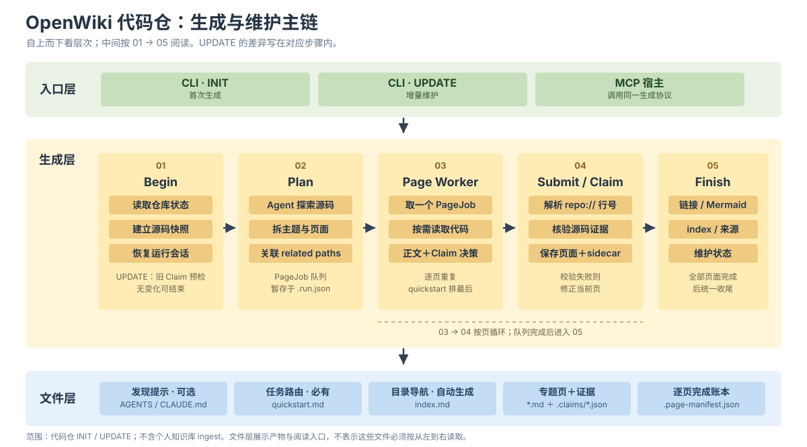

# OpenWiki 实验：什么时候有帮助？

这份首页汇总三个实验，统一回答：**与不使用 OpenWiki 的同条件基线相比，质量、速度和成本有什么变化？** 各实验的任务、指标和模型不同，只在各自实验内部比较。原始表格与详细口径保留在文末。

## 一眼看结论

| 场景 | 质量或性能变化 | 速度与成本 | 当前判断 |
| --- | --- | --- | --- |
| 仓库问答（RepoProbe，122 道共同题） | 强制读 Wiki **+0.26/10 分**；按需读 **+0.22/10 分** | 强制组回答时间 **−21.4%**，输入 token **+68.4%** | 小幅质量收益，每题每组仅一次回答 |
| 代码修复（SWE-bench，18 道共同题） | 强制与按需组均 **15/18**，与无 Wiki **持平** | 强制组耗时 **+10.6%**，总 token **+10.1%** | 未见解决率收益 |
| 算子优化（5 个算子，正式实验快照） | B/C/D 相对无 Wiki 的平均性能差：**−0.24 / −1.82 / −0.60 个百分点** | 算子间方向不同；6 格尚未归档 | 有局部收益，未见稳定的总体优势 |

正负号均相对各实验的**无 Wiki 基线**。耗时和 token 的负值表示减少；算子性能差的正值表示比无 Wiki 方案多获得吞吐量提升。

## OpenWiki 代码仓生成与维护主链

[查看 SVG 原图](./diagrams/openwiki-code-flow.svg) · [查看 HTML 版本](./diagrams/openwiki-code-flow.html)

## 实验一：仓库问答

CANNBot `glm-5.2` 在 RepoProbe 的 **122 道共同可运行题**上回答，每题每组一次独立回答。得分按每题 checklist 归一到 10 分；“模型步骤”是回答阶段每题的 model call 次数，并非算子优化的迭代轮数。下列 token 均为**每题平均**，按原始组总量除以 122；输入、输出、推理和缓存读取分别列出，不合并为计费 token。

| 方案 | 均分 /10 | 较基线 | 回答秒/题 | 模型步骤/题 | 输入 token/题 | 输出 token/题 | 推理 token/题 | 缓存读取/题 | 实际读 Wiki |
| --- | ---: | ---: | ---: | ---: | ---: | ---: | ---: | ---: | ---: |
| 仅代码仓（基线） | 5.39 | — | 193.4 | 7.62 | 76,661 | 1,700 | 3,341 | 172,602 | 0/122 |
| 代码仓 + 强制 OpenWiki | **5.66** | **+0.26 分** | **152.0** | 11.51 | 129,093 | 2,097 | 5,046 | 334,555 | 122/122 |
| 代码仓 + 可选 OpenWiki | **5.61** | **+0.22 分** | 186.0 | 8.91 | 91,750 | 1,863 | 3,569 | 217,521 | 27/122 |
| 仅 OpenWiki | 3.40 | −1.99 分 | 83.2 | 6.62 | 69,565 | 1,445 | 2,121 | 110,440 | 122/122 |
| 代码仓 + `/init AGENTS.md` | 5.29 | −0.11 分 | 154.0 | 10.74 | 105,969 | 2,111 | 4,247 | 304,961 | 0/122 |
| 代码仓 + 静默可见 OpenWiki | 5.37 | −0.02 分 | 158.2 | 8.14 | 69,391 | 1,832 | 3,020 | 216,766 | 7/122 |

**六组具体输入与约束：**

| 组别 | Agent 能看到什么、需要做什么 |
| --- | --- |
| 仅代码仓 | 只有源码仓；按源码回答，无生成的 Wiki。 |
| 代码仓 + 强制 OpenWiki | 源码和 `openwiki/` 同时可用；查源码前必须读 `quickstart.md` 和至少一个相关 Wiki 页面，再用源码核实。 |
| 代码仓 + 可选 OpenWiki | 源码和 `openwiki/` 同时可用；提示 Wiki 可作导航，但是否读取由 Agent 决定，关键结论仍需源码核实。 |
| 仅 OpenWiki | 工作区仅有生成的 Wiki、没有源码；必须读 `quickstart.md` 和至少一个相关页面，并只据 Wiki 回答。 |
| 代码仓 + `/init AGENTS.md` | 源码和生成的根目录 `AGENTS.md`；先读该仓库地图，再查源码，禁止访问 `openwiki/`。这是仓库地图对照组。 |
| 代码仓 + 静默可见 OpenWiki | 源码和 `openwiki/` 同时存在，但沿用仅代码仓的提示词，不注入 Wiki 提示；测试 Agent 是否自发读取。 |

**小结：** 保留源码时，强制或按需使用 Wiki 都对应小幅更高的均分；只给 Wiki、不提供源码则明显低于基线。强制组回答时间比基线少 **21.4%**，但输入 token/题多 **68.4%**，模型步骤也更多。单次回答不能据此断言差异具有统计显著性。完整数据：[实验说明](./experiments/repoprobe-cannbot/six-arm-122/README.md) · [CSV](./experiments/repoprobe-cannbot/six-arm-122/repoprobe-six-arm-122-summary.csv)。

## 实验二：SWE-bench 代码修复

解决率来自官方 ARM64 Harness；耗时、token 与迭代来自最终入表的 solver session。**前五组**使用 `cannbot/glm-5.2` 的相同 18 题；最后两组列出实际数据供查阅，但不纳入同条件比较。Wiki 使用只计 trace 中返回**非空正文**的读取。

| 方案 | 解决率 | 较基线 | 平均解题时间 | 平均总 token/题 | 平均非缓存 token/题 | 平均迭代/题 | 有效读 Wiki |
| --- | ---: | ---: | ---: | ---: | ---: | ---: | ---: |
| 无 Wiki（基线） | **15/18** | — | 16.7 分 | 3,884,564 | 403,003 | 65.4 | 0/18 |
| 强制先读 Wiki | **15/18** | **持平** | 18.5 分 | 4,277,842 | 461,971 | 62.8 | 18/18，均早于首次编辑 |
| 按需读 Wiki | **15/18** | **持平** | 19.0 分 | 5,007,743 | 629,339 | 65.7 | 5/18，其中 2/18 早于首次编辑 |
| Wiki 导航卡注入 | 14/18 | −1 题 | 26.0 分 | 4,757,042 | 643,330 | 70.1 | 主动读取 0/18；卡片注入 18/18 |
| 可选 grep quickstart | **15/18** | **持平** | 18.0 分 | 3,883,684 | 379,119 | 66.8 | 0/18 |
| AGENTS index/quickstart† | 13/17 | 不可比 | 26.4 分 | 6,886,968 | 833,889 | 71.6 | 17/17 |
| Wiki-before-source v2 fixed‡ | 12/18 | 不可比 | 27.6 分 | 5,525,577 | 227,650 | 61.5 | 18/18 |

**七组具体介入方式：**

| 组别 | Agent 得到什么指令或材料 |
| --- | --- |
| 无 Wiki | 只有修复前源码，不提供 Wiki。 |
| 强制先读 Wiki | 查源码前必须读 `quickstart.md` 和至少一个相关 Wiki 页面。 |
| 按需读 Wiki | 根目录 `AGENTS.md` 告知 Wiki 存在，Agent 自行决定是否读。 |
| Wiki 导航卡注入 | runner 从 Wiki 生成短导航卡并放入初始 prompt；不要求 Agent 主动读取页面。 |
| 可选 grep quickstart | 提示可以 grep `quickstart.md`，但不强制；本次 trace 中没有有效正文读取。 |
| AGENTS index/quickstart† | `index.md` 作总地图；改架构前读 index、测试前读 quickstart，并禁止盲搜。 |
| Wiki-before-source v2 fixed‡ | 换用 `glm-5.3`，要求先检索 Wiki 再查源码，并执行严格路由协议。 |

总 token 含缓存读取；非缓存 token 为输入、输出、推理和缓存写入之和。两种 token 列供观察不同成本口径，不应相加。† 仅 17 题有官方结果。‡ 模型不同，且只有 7/18 格满足严格协议。

**小结：** 在共同题目上，实际读取 Wiki 的强制与按需组均未提高解决率，且平均耗时和 token 上升。导航卡是**注入 Wiki 派生内容**，不是 Agent 主动读取。可选 grep 组没有有效正文读取，因此不能算 Wiki 使用带来的效果。

强制组相对基线平均耗时 **+10.6%**、总 token **+10.1%**；按需组分别 **+13.4%**、**+28.9%**。所有组的详细依据见[完整实验表与证据口径](./experiments/openwiki-swebench-2026-09/README.md)及[结构化汇总](./experiments/openwiki-swebench-2026-09/openwiki-all-experiments-2026-09-22.json)。

## 实验三：算子优化

920C 汇总快照中的正式实验使用 `cannbot/glm-5.3`（部分正式归档从 920B 迁入）。四组都在同一算子上做优化，但搜索与 Wiki 介入方式不同：

| 组别 | 具体做法 |
| --- | --- |
| A：无 Wiki | 原始源码搜索，不读 Wiki；作为本实验的无 Wiki 对照。 |
| B：搜索时参考 Wiki | 在源码搜索阶段增加 OpenWiki 参考，源码 grep 不限制范围。 |
| C：Wiki 定向搜索 | 用 Wiki 导航，首轮限制在 5 个文件 / 2 个目录；未命中可扩展一次。 |
| D：AGENTS 规则 | 原始 optimizer skill 加根目录 `AGENTS.md` 触发规则；改架构前读 `index.md`、构建或测试前读 `quickstart.md`，禁止无边界全仓搜索。 |

每格先取该次最终 **7 次性能测量的中位数**；下表“最终性能中位数”再取同组有效重复的中位数。GF/CRC 单位为 MB/s，libm/TLFloat 为 Mops/s，DFT 为 Mflops，**绝对吞吐量不可跨算子相加或平均**。“性能提升中位数”是相对本算子原始基线的提升；“较 A 配对差”才是 OpenWiki 与无 Wiki 的比较，单位为百分点。它只使用同一算子、同一重复编号中 A 与目标组都正式有效的格，正值表示该组比 A 好。

| 算子（性能单位） | 组别 | 较 A 配对差（百分点） | 最终性能中位数 | 性能提升中位数 | 非缓存 token 中位数 | 耗时中位数（分） | 平均迭代轮数 | 有效/计划 |
| --- | --- | ---: | ---: | ---: | ---: | ---: | ---: | ---: |
| `gf_vect_mul`（MB/s） | A | — | 46,721.24 | 20.51% | 399,097 | 55.0 | 3.0 | 3/3 |
|  | B | −0.24（3 对） | 46,153.64 | 19.47% | 383,477 | 39.4 | 3.0 | 3/3 |
|  | C | −2.19（2 对） | 46,075.52 | 18.31% | 273,605 | 35.9 | 3.0 | 2/3 |
|  | D | −5.69（3 对） | 46,619.60 | 20.43% | 580,321 | 38.7 | 2.7 | 3/3 |
| `crc32_ieee`（MB/s） | A | — | 24,110.49 | 35.57% | 673,029 | 89.2 | 2.7 | 3/3 |
|  | B | **+11.22（3 对）** | 26,497.07 | 49.14% | 886,744 | 119.4 | 3.0 | 3/3 |
|  | C | −6.27（3 对） | 22,846.45 | 28.72% | 764,022 | 85.6 | 3.0 | 3/3 |
|  | D | −1.30（2 对） | 25,870.39 | 45.65% | 669,724 | 90.7 | 3.0 | 2/3 |
| `libm_sin_cos_dp`（Mops/s） | A | — | 172.64 | 8.10% | 431,885 | 43.9 | 3.0 | 3/3 |
|  | B | −4.55（3 对） | 166.21 | 3.63% | 403,229 | 47.1 | 3.0 | 3/3 |
|  | C | −3.59（3 对） | 167.79 | 4.98% | 447,985 | 42.5 | 3.0 | 3/3 |
|  | D | −3.88（3 对） | 163.52 | 2.36% | 628,022 | 73.5 | 3.0 | 3/3 |
| `dftbench_double`（Mflops） | A | — | 14,095.15 | 26.57% | 419,591 | 79.7 | 3.0 | 2/3 |
|  | B | −6.17（2 对） | 13,371.85 | 20.40% | 661,347 | 65.6 | 3.0 | 2/3 |
|  | C | −5.81（2 对） | 13,428.90 | 20.76% | 543,849 | 60.6 | 3.0 | 2/3 |
|  | D | **+5.50（2 对）** | 14,663.85 | 32.07% | 817,234 | 100.0 | 3.0 | 2/3 |
| `tlfloat_quad_arithmetic`（Mops/s） | A | — | 76.95 | 6.06% | 439,339 | 61.2 | 2.3 | 3/3 |
|  | B | −1.43（3 对） | 74.93 | 3.29% | 516,102 | 98.3 | 3.0 | 3/3 |
|  | C | **+8.74（3 对）** | 84.04 | 15.78% | 487,120 | 80.2 | 3.0 | 3/3 |
|  | D | **+2.39（3 对）** | 75.21 | 3.67% | 430,132 | 89.8 | 3.0 | 3/3 |

**同类合并结果：** 先在每个算子内平均配对差，再对 5 个算子等权平均；token 与耗时先按配对计算相对 A 的百分比变化，再按算子等权平均。各组的成本变化没有把不同算子的绝对数值直接相加。

| 组别 | 相对 A 平均性能差 | 胜过 A 的算子 | 配对非缓存 token 变化 | 配对优化耗时变化 | 正式有效格 | 有效读 Wiki |
| --- | ---: | ---: | ---: | ---: | ---: | ---: |
| A：无 Wiki | — | — | — | — | 14/15 | 0/14 |
| B：参考 Wiki | **−0.24 个百分点** | 1/5 | +16.6% | +10.0% | 14/15 | 14/14 |
| C：定向搜索 | **−1.82 个百分点** | 1/5 | +4.6% | **−5.6%** | 13/15 | 13/13 |
| D：AGENTS 规则 | **−0.60 个百分点** | 2/5 | +26.5% | +20.8% | 13/15 | 13/13 |

**小结：** B 对 CRC、C 对 TLFloat、D 对 DFT/TLFloat 有局部性能收益；没有一种 Wiki 方式在五个算子上普遍胜过 A。C 的平均优化耗时较短，但平均性能差仍为负。正式实验目前 **54/60 格**有效归档；GF C3、CRC D1 和 DFT 的 A3/B3/C3/D3 未归档，现有配对平均只能作为快照。`isal_zero_detect` 的 pilot 使用另一阶段及复测口径，未混入正式平均。详见[算子实验说明](./experiments/openwiki-optimizer-920c-2026-09/README.md)与[逐格 TSV](./experiments/openwiki-optimizer-920c-2026-09/session-results-2026-09-24.tsv)。

## 最终结论

**OpenWiki 的收益依赖任务与使用方式，不能笼统宣称“接入后整体提升”。** 目前最明确的正向信号是仓库问答均分提高约 **0.22–0.26/10 分**，但输入 token 成本上升；SWE-bench 的共同题没有解决率增益；算子优化有少数算子和策略受益，五算子等权平均尚未显示性能优势。若要进一步证明稳定收益，需要补齐算子缺格，并在同一题目、模型、预算和评测环境下增加独立重复。三个实验的分数、吞吐量和 token 口径各不相同，不跨实验合并平均。
